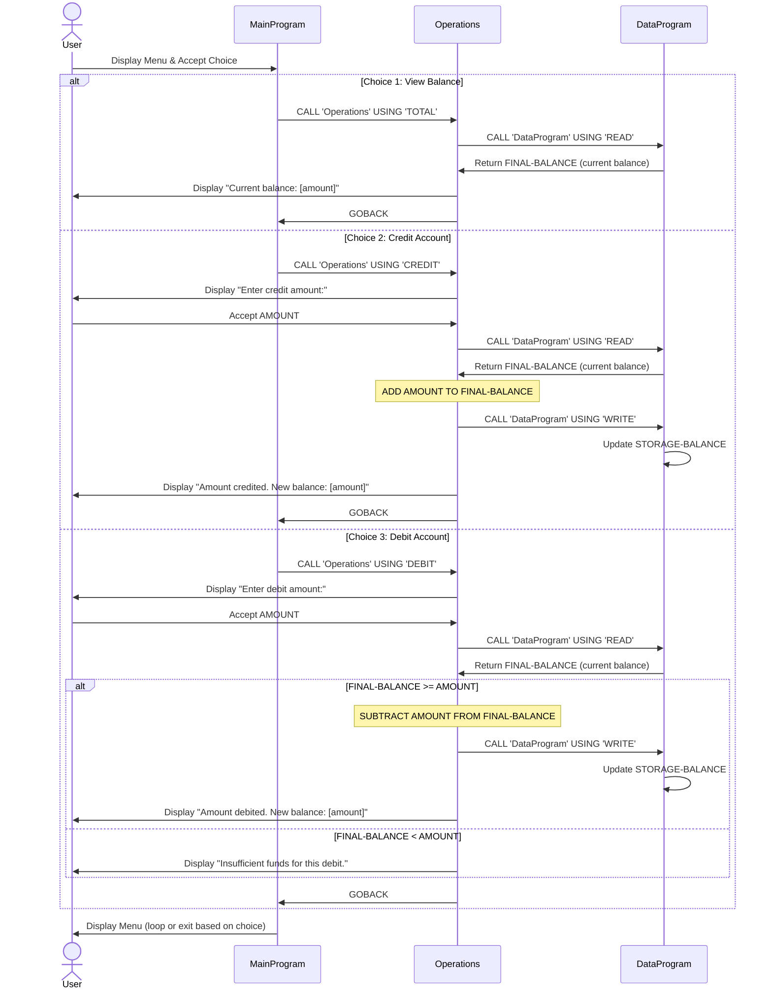

# COBOL Student Account Management System Documentation

## Overview

This documentation describes the COBOL-based Student Account Management System, a legacy program designed to manage student account operations including balance inquiries, credits, and debits.

---

## COBOL Files

### 1. **main.cob** - Main Program
**Purpose:** Entry point for the application. Provides a menu-driven interface for user interaction.

**Key Functions:**
- **Menu Display**: Shows available account management options to the user
- **User Input Handling**: Accepts and processes user choices (1-4)
- **Program Flow Control**: Loops until user exits the program
- **Module Orchestration**: Routes user selections to the Operations module via CALL statements

**Business Logic:**
- Presents four menu options:
  1. View Balance (calls Operations with 'TOTAL ')
  2. Credit Account (calls Operations with 'CREDIT')
  3. Debit Account (calls Operations with 'DEBIT ')
  4. Exit Program

**Variables:**
- `USER-CHOICE`: Numeric input for menu selection (PIC 9)
- `CONTINUE-FLAG`: Control flag to manage program loop ('YES'/'NO')

---

### 2. **operations.cob** - Operations Module
**Purpose:** Implements core business logic for account operations (balance inquiry, credits, and debits).

**Key Functions:**

#### a. **TOTAL Operation**
- Retrieves and displays the current account balance
- Calls DataProgram with 'READ' operation
- Displays: "Current balance: [amount]"

#### b. **CREDIT Operation**
- Accepts amount input from user
- Retrieves current balance from DataProgram
- Adds the credit amount to the balance
- Writes updated balance back to DataProgram
- Displays confirmation with new balance

#### c. **DEBIT Operation**
- Accepts amount input from user
- Retrieves current balance from DataProgram
- Validates sufficient funds **before** processing
  - **Business Rule**: Debit is only allowed if `FINAL-BALANCE >= AMOUNT`
  - If insufficient funds, displays error message: "Insufficient funds for this debit."
- Subtracts the debit amount from balance (if funds available)
- Writes updated balance back to DataProgram
- Displays confirmation with new balance

**Variables:**
- `OPERATION-TYPE`: Type of operation being performed (PIC X(6))
- `AMOUNT`: Monetary amount for credit/debit operations (PIC 9(6)V99)
- `FINAL-BALANCE`: Current account balance (PIC 9(6)V99, initial value: 1000.00)

---

### 3. **data.cob** - Data Program
**Purpose:** Encapsulates data storage and management. Acts as a data access layer for account balance persistence.

**Key Functions:**

#### a. **READ Operation**
- Retrieves the current account balance from storage
- Returns the balance to the calling program

#### b. **WRITE Operation**
- Updates the stored account balance with a new value
- Persists the balance for future READ operations

**Variables:**
- `STORAGE-BALANCE`: Internal persistent storage for account balance (PIC 9(6)V99, initial value: 1000.00)
- `OPERATION-TYPE`: Type of operation ('READ' or 'WRITE')

---

## Student Account Business Rules

### 1. **Initial Balance**
- All student accounts start with an initial balance of **1000.00**

### 2. **Insufficient Funds Protection**
- **Critical Rule**: Debit (withdrawal) operations are **rejected** if the requested amount exceeds the current account balance
- Error message: "Insufficient funds for this debit."
- The balance remains unchanged if a debit operation is denied

### 3. **Credit Operations**
- Credits (deposits) can be performed without restrictions
- Any amount may be credited to increase the account balance

### 4. **Balance Inquiry**
- Users can view their current balance at any time
- Balance inquiries do not modify the account

### 5. **Data Persistence**
- Balance is maintained in the STORAGE-BALANCE variable of the DataProgram
- Changes to balance persist across operations within the program session
- Note: This is session-based persistence; data does not persist between program runs

---

## Program Flow Diagram

```
MainProgram (Entry Point)
    ↓
[Display Menu] → Accept User Input
    ↓
[EVALUATE Choice]
    ├─→ Choice 1: Call Operations('TOTAL ')
    │       ↓
    │       Operations calls DataProgram('READ')
    │       Display current balance
    ├─→ Choice 2: Call Operations('CREDIT')
    │       ↓
    │       Accept amount → Operations calls DataProgram('READ')
    │       Add amount → Operations calls DataProgram('WRITE')
    │       Display new balance
    ├─→ Choice 3: Call Operations('DEBIT ')
    │       ↓
    │       Accept amount → Operations calls DataProgram('READ')
    │       Validate: BALANCE >= AMOUNT?
    │       ├─ YES: Subtract → Call DataProgram('WRITE') → Display new balance
    │       └─ NO: Display "Insufficient funds" error
    └─→ Choice 4: Exit → STOP RUN

[Loop until CONTINUE-FLAG = 'NO']
```

---

## Technical Notes

### Data Types Used
- **PIC 9(6)V99**: Numeric field for monetary amounts (6 digits before decimal, 2 after)
- **PIC X(6)**: Character field for operation type indicators
- **PIC 9**: Single digit for user menu input
- **PIC X(3)**: Character field for control flags

### Inter-Program Communication
- Programs communicate via CALL statements with USING linkage
- Parameters are passed by reference to allow data exchange
- LINKAGE SECTION defines the interface between programs

### Program Termination
- MainProgram terminates with STOP RUN
- SubPrograms return control with GOBACK statement

---

## Maintenance and Modernization Notes

This legacy COBOL system is a candidate for modernization including:
- Database integration for persistent data storage
- Web API interface to replace menu-driven interaction
- Input validation and error handling improvements
- Transaction logging and audit trails
- Conversion to modern programming languages (Java, Python, etc.)

---

## Data Flow Sequence Diagram

The following diagram illustrates the complete data flow for the three main operations (View Balance, Credit, Debit) in the student account management system:



**Data Flow Key Points:**

1. **User Input**: Menu choices and amount inputs flow through MainProgram to Operations
2. **Balance Retrieval**: All operations read the current balance via DataProgram's READ operation
3. **Balance Updates**: Credit and Debit operations write back updated balance via DataProgram's WRITE operation
4. **Validation**: Debit operation validates sufficient funds before modifying balance
5. **State Management**: DataProgram maintains the single source of truth (STORAGE-BALANCE) throughout program execution
